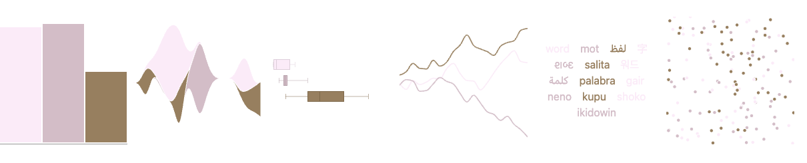
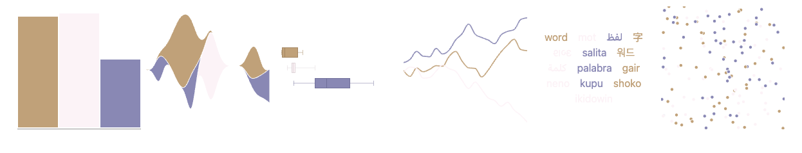
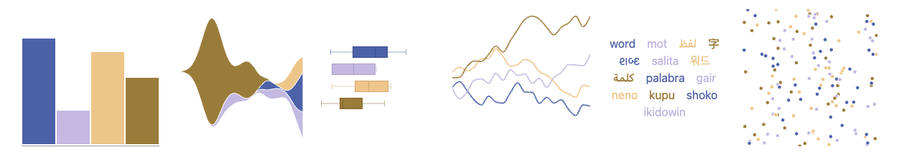

# Paleta de color accesible

Fuente: ColorBrewer 2. Las paletas fueron seleccionadas con el filtro
`color-blind safe` activado.

## Secuencial — BuGn (3 clases)

Uso: valores cuantitativos ordenados de menor a mayor en el gráfico P1.

- `#e5f5f9` — incremento bajo.
- `#99d8c9` — incremento intermedio.
- `#2ca25f` — incremento alto.

Validación: `color-blind safe` confirmado en ColorBrewer.

Simulación deuteranopía: 

## Divergente — PRGn (3 clases)

Uso: cambio de intensidad de carbono en P7, con cero como punto medio.

- `#7fbf7b` — cambio negativo (mejora).
- `#f7f7f7` — cambio cercano a cero.
- `#af8dc3` — cambio positivo (empeora).

Validación: `color-blind safe` confirmado en ColorBrewer.

Simulación deuteranopía: 

## Cualitativa — Paired (4 clases)

Uso: países de la comparación temporal en P9. Se utiliza la variante de cuatro
clases porque el gráfico contiene cuatro países.

- `#1f78b4` — Perú.
- `#a6cee3` — Chile.
- `#b2df8a` — Colombia.
- `#33a02c` — Brasil.

Validación: `color-blind safe` confirmado en ColorBrewer. La distinción no
depende únicamente del color: P9 también usa diferentes patrones de línea y
mayor grosor para Perú.

Simulación deuteranopía: 

